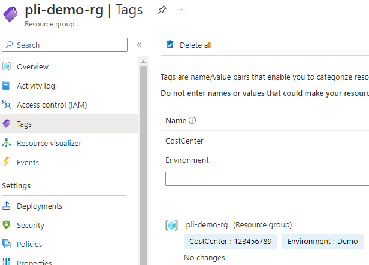

This little sample GoLang app pulls resource group data from Azure and generates Terraform code.

The following screenshot shows an existing resource group in Azure:



To run the sample:
1. Set up environment variables (with data from a Service Principle):
```
export AZURE_SUBSCRIPTION_ID="......"
export AZURE_TENANT_ID="......"
export AZURE_CLIENT_ID="......"
export AZURE_CLIENT_SECRET="......"
```

2. Modify the localtion and resourceGroupName in main.go (line 26 & 27):
```
var (
	subscriptionID    string
	location          = "South Central US"
	resourceGroupName = "pli-demo-rg"
)
```
3. Run `go run main.go` and it will generates two Terraform configuration files, providers.tf and main.tf, respectively.

Generated proviers.tf code:
```
terraform {
  required_providers {
    azurerm = {
      source  = "hashicorp/azurerm"
      version = "3.23.0"
    }
  }
}

provider "azurerm" {
  features {
  }
}

```

Generated main.tf code:
```
resource "azurerm_resource_group" "this" {
  name     = "pli-demo-rg"
  location = "southcentralus"
  tags = {
    CostCenter  = "123456789"
    Environment = "Demo"
  }
}
```